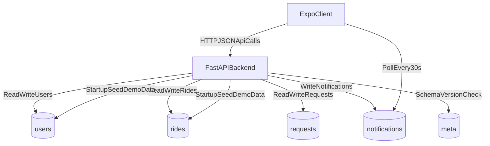
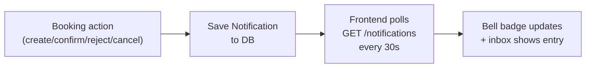

# UKTaxi System Architecture

## High-Level Architecture
UKTaxi is a 3-tier application:
1. Expo mobile client
2. FastAPI backend (modular `app/` package)
3. MongoDB Atlas database

The frontend is role-aware (`user`, `driver`) and calls a single backend API namespace (`/api/*`).

## Component Map
- Client (`frontend/`)
  - Auth gate + role-based routing
  - Passenger flow: browse rides → request seats → track ticket → notifications inbox
  - Driver flow: publish rides → manage offline seats → approve/reject requests → notifications inbox
- API (`backend/app/`)
  - Modular FastAPI package — routers split by domain
  - `server.py` is a thin entry-point shim (`from app.main import app`)
  - Pydantic models per domain in `app/models/`
  - Booking, seat-state, and notification business rules
- Persistence (MongoDB)
  - Collections: `users`, `rides`, `requests`, `notifications`, `meta`

## End-to-End Runtime Flow

## Request Lifecycle
### Passenger booking lifecycle
1. Passenger selects role → enters phone → verifies OTP → registers name (new user only).
2. App fetches published rides (`GET /api/rides`) filtered by route/date.
3. Passenger submits seat request (`POST /api/requests`).
4. Backend saves booking and writes a notification for the driver.
5. Driver reviews request and confirms/rejects.
6. On confirm, backend appends seats to `ride.booked_seats` and writes a notification for the passenger.
7. Ticket view reflects request status and cancellation eligibility.
8. Passenger's bell tab shows the notification within the next 30-second poll.

### Driver publishing lifecycle
1. Driver selects role → enters phone → OTP → registers name, vehicle type, plate.
2. Driver publishes ride with route/time/price and optional offline seats.
3. Backend validates seat numbers against vehicle layout.
4. Ride is visible to passengers with computed `seats_left`.
5. Driver can update offline seats and cancel a ride (outside 30-minute cutoff).
6. Ride cancellation cascades to all pending/confirmed requests and writes notifications for each affected passenger.

## Notification Flow
All notifications are persisted to MongoDB, not device push, so they survive whether or not the recipient is online.

## Architectural Decisions
- **Modular backend package:** Backend is split into `app/routers/`, `app/models/`, `app/helpers.py`, `app/seed.py`, `app/notifications.py`. `server.py` is a one-line shim.
- **Phone-first identity:** No JWT/session token in current version; phone number is passed in API calls and used as principal.
- **Denormalized booking snapshot:** Requests store ride and driver snapshot fields to preserve ticket context.
- **Startup demo seeding:** App auto-seeds sample users/rides based on schema version.
- **DB-backed notifications only:** expo-notifications removed; all notifications persisted in MongoDB and polled by client.

## Operational Boundaries
- Environment boundaries:
  - Frontend: `EXPO_PUBLIC_BACKEND_URL`, `EXPO_PUBLIC_BACKEND_PORT`
  - Backend: `MONGO_URL`, `DB_NAME`, `CORS_ORIGINS`
- CORS configurable via `CORS_ORIGINS` env variable (default `*` for dev).
- Backend started with: `uvicorn server:app --host 0.0.0.0 --port 8000`

## Known Risks and Trade-offs
- No transactional seat booking flow; concurrent confirms can race.
- Startup seed can drop and recreate major collections when schema changes.
- API auth is trust-based on phone values (suitable for demo, not hardened production).
- 30-second polling for notifications introduces up to 30-second delivery delay.
