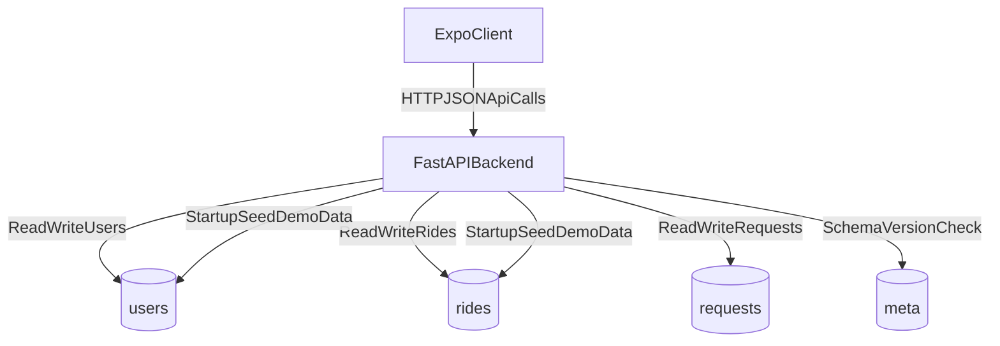

# UKTaxi System Architecture

## High-Level Architecture
UKTaxi is a 3-tier application:
1. Expo mobile/web client
2. FastAPI backend
3. MongoDB database

The frontend is role-aware (`user`, `driver`) and calls a single backend API namespace (`/api/*`).

## Component Map
- Client (`frontend`)
  - Auth gate + role-based routing
  - Passenger flow: browse rides -> request seats -> track ticket
  - Driver flow: publish rides -> manage offline seats -> approve/reject requests
- API (`backend/server.py`)
  - Monolithic FastAPI app with route groups by domain
  - Pydantic models for transport contracts
  - Booking and seat-state business rules
- Persistence (MongoDB)
  - Collections: `users`, `rides`, `requests`, `meta`

## End-to-End Runtime Flow

## Request Lifecycle
### Passenger booking lifecycle
1. Passenger logs in or registers using phone OTP flow.
2. App fetches published rides (`GET /api/rides`) filtered by route/date.
3. Passenger submits seat request (`POST /api/requests`).
4. Driver reviews request and confirms/rejects.
5. On confirm, backend appends seats into `ride.booked_seats`.
6. Ticket view reflects request status and cancellation eligibility.

### Driver publishing lifecycle
1. Driver profile contains selected vehicle preset + seat layout.
2. Driver publishes ride with route/time/price and optional offline seats.
3. Backend validates seat numbers against vehicle layout.
4. Ride is visible to passengers with computed `seats_left`.
5. Driver can update offline seats and cancel a ride (outside 30-minute cutoff).

## Architectural Decisions
- **Single backend module:** All API routes and models currently live in one file (`backend/server.py`) for rapid iteration.
- **Phone-first identity:** No JWT/session token; phone number is passed in API calls and used as principal.
- **Denormalized booking snapshot:** Requests store ride and driver snapshot fields to preserve ticket context.
- **Startup demo seeding:** App auto-seeds sample users/rides based on schema version.

## Operational Boundaries
- Environment boundaries:
  - Frontend: `EXPO_PUBLIC_BACKEND_URL`
  - Backend: `MONGO_URL`, `DB_NAME`
- CORS is currently permissive (`allow_origins=["*"]`) for development/demo use.

## Known Risks and Trade-offs
- No transactional seat booking flow; concurrent confirms can race.
- Startup seed can drop and recreate major collections when schema changes.
- API auth is trust-based on phone values (suitable for demo, not hardened production).
